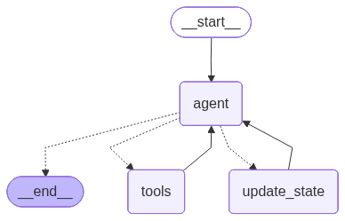

# AI Travel Agent

This project is a simple AI-powered travel agent web app. It uses a conversational agent built with **LangGraph** to assist users in planning their trips. The application is a backend service using **Django** to handle web requests and an agentic framework to manage the conversation flow.

### Agent Workflow Graph

  

